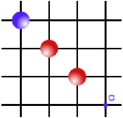
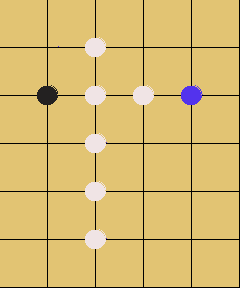
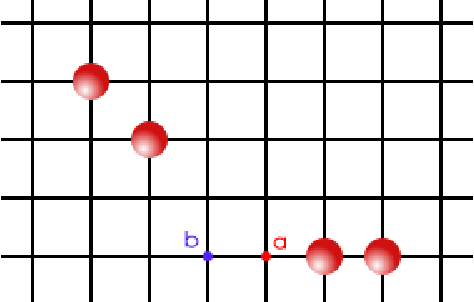
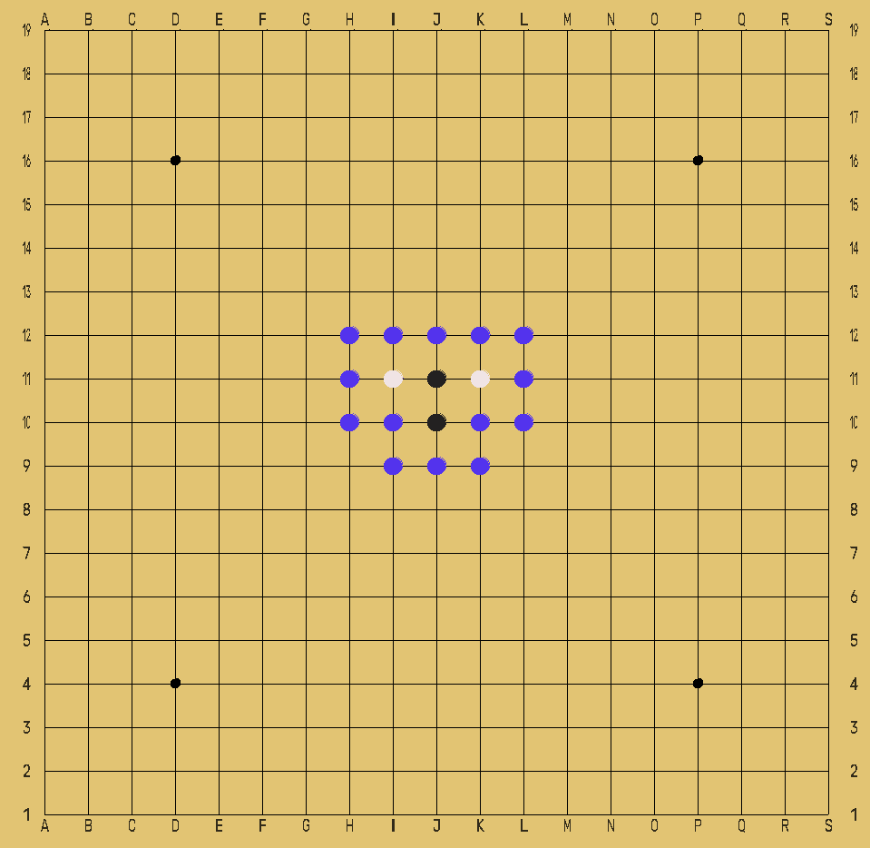
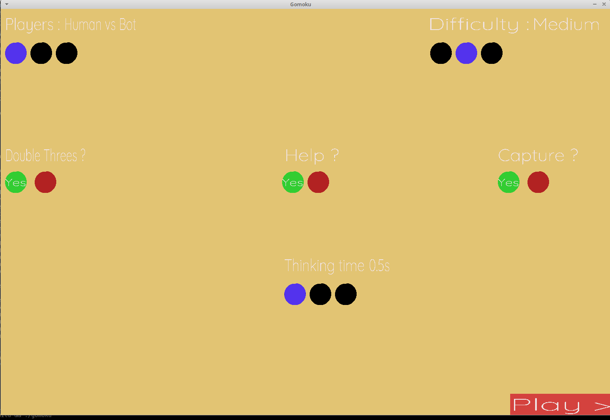
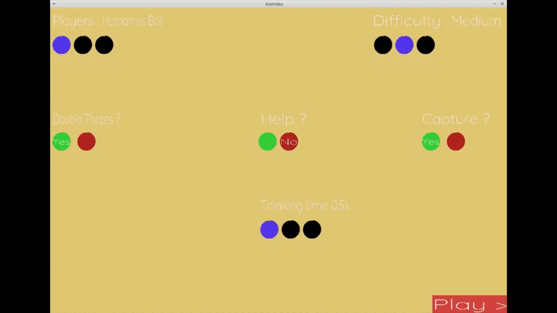

# GOMOKU
##### By @ayguillo and @HkhanH #####

#### *This project is a  school project*  ####
# 

## Constraints
AI that can win over a human at gomoku under 0.5 second per move with minimax algorithm
##

## Installation
You need the golang version 1.16.6 or less and to install go-sdl2 depending your OS :
[install go-sdl2](https://github.com/veandco/go-sdl2#requirements).

After this install you can execute
```
go mod init gomoku
go mod tidy
go build
```
##

## Rules
### Win
You must align 5 stones to win.
###
### Captures - *As in the Ninuki-renju or Pente variants* - (option)
You can remove a pair of your opponent’s stones from the board by flanking them with your own stones.

This rule adds a win condition : If you manage to capture ten of your opponent’s stones, you **win** the game.

 

##### Note : One can only capture PAIRS, not single stones, and not more than 2 stones in a row. #####

### Game-ending capture
A player that manages to align five stones only wins if the opponent can not break this alignment by capturing a pair, or if he has already lost four pairs and the opponent can capture one more, therefore winning by capture.



### No double-three (option)
It is forbidden to play a move that introduces two free-three alignments, which would guarantee a win beny alignment.



###
##
## Algorithm explanation
We used minimax algorithm with alphabeta prunning. To achieve a move under 0.5 second, we limited the exploration at 5 depth in default settings.
### Alpha beta prunning
Alpha-beta pruning reduces the number of nodes that are evaluated by the minimax algorithm in its search tree.

We keep track of two values: Alpha and Beta.
- Alpha = the minimum score that the player is assured of.
- Beta = the maximum score that the opponent is assured of.
Initially, alpha is negative infinity and beta is positive infinity.

It stops evaluating a move when at least one possibility has been found that proves the move to be worse than a previously examined move.
###
### FindNeighbors()
During the search, we don't evaluate all the Goban but only the neighbors to limited the tree search.

 

###
##

## Interface
The interface is very simply, and developed with sdl2.

In the menu, you can set all the rules, and disable/enable the captures, and no double-three rule.

You can also play against a bot, or an another player.
We have developed an helper who can suggest a move, but warning, it's not the best move ! This option can be disable.

Feel free to use the "thinking time" option. The algorithm will have more time to process and search the best move in the tree search.



##

## **Now can you win against the AI ?**
